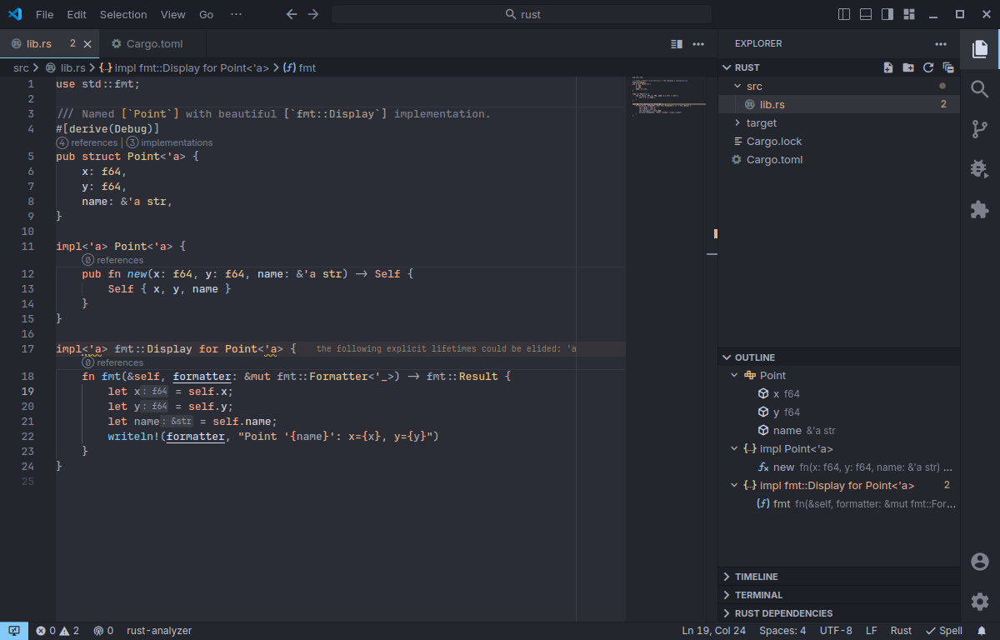

# Pastel Evening Theme 

Dark theme with pastel colors and a slight blue hint to the editor.

We provide two variants of the theme as a base with options to easily customize the theme.

### Pastel Evening Dark (original)


### Pastel Evening Dark #2



## Color scheme

This theme aims to use relatively few different colors but still clearly distinguish different elements in the code. 
The comments are purposefully muted to emphasize the actual code. 
Short summary about colors and their meaning is below. Note however that it's possible to change them to your liking.

Additionally static variables and methods are in *italic* (where possible). 
Mutable variables are underlined in languages where mutable variables are special, like Rust and Kotlin. 
See [ColorScheme] and [ColorScheme #2] for more details about the color scheme.

It is recommended to use this theme with semantic highlighting. 
It will work without it as well, but may miss some colors.

Style related editor settings used to develop this theme are
```json
"editor.fontFamily": "'JetBrains Mono'",
"editor.fontSize": 13,
"editor.inlayHints.fontSize": 10,
"editor.fontWeight": 600,
"editor.fontLigatures": true,
"workbench.iconTheme": "material-icon-theme",
```
It's worth noting that Linux's and Windows' font rendering is different, I have found that on Linux `fontWeight=600` is about the same look as `fontWeight=425` on Windows using `JetBrains Mono` font. 
With same `fontWeight` the theme looks quite a bit brighter on Windows than on Linux.
Thus if the colors seem a bit too bright you can slightly lower the fontWeight and other way around too.


## Configuration

This theme includes various configuration options to easily customize the theme to your liking. 
Check out the extension settings in VSCode itself, they should be relatively self-explanatory with small description on each option there.
Also you can see the next section for some examples.

Note that customization only apply to the main theme variant `Pastel Evening Dark`, 
they don't apply to any of the other variants like `Pastel Evening Dark #2`.
However you can select the base theme for customization using `pastelEveningTheme.colorOverrides.baseScheme` option.
For example
```json
"pastelEveningTheme.colorOverrides.baseScheme": "Pastel Evening Dark #2"
```
to use `Pastel Evening Dark #2` variant as base.


### Variants

Below are a set of configurations you may be interested in trying out.
The settings are given as a json so you can easily copy them to your `settings.json`.

* Orange keywords (looks a bit less rainbow)
    ```json
    "pastelEveningTheme.colorOverrides.tokens": {
        "keywords": "orange"
    }
    ```
    

* Variant #2 with lime green interfaces for a bit more contrast

    ```json
    "pastelEveningTheme.colorOverrides.baseScheme": "Pastel Evening Dark #2",
    "pastelEveningTheme.colorOverrides.tokens": {
        "interfaces": "lime green",
    }
    ```
    

## Tested languages

The theme has been tested with various languages, mainly against the examples from [Code Syntax Examples] repo but with some other projects as well.

* C++, C#, F#, Go, Haskell, Java, Javascript (.js, .jsx), Typescript (.ts, .tsx), CSS, HTML, Kotlin, Python, Ruby, Rust, Dart[^1], Elm[^1], PHP[^1], Scala[^1]
* Markup and text
    * LaTeX, Markdown, AsciiDoc
* Misc
    * HCL, INI, JSON, RON, TOML, XML, YAML, Pest, Cabal, 

[^1]: Have been tested with very short snippet.

## Contributions

All suggestions, requests or improvements are very welcome. 
Submit an [issue] or [pull request] and we'll see what can be done.
Check out [CONTRIBUTING.md] for more information.

## Inspiration

This theme's code style is inspired by [Panda Syntax]'s and [Gatito Theme]'s pastel colors. 
Editor's UI style is inspired by [Lapce] editor's default dark theme.

## License

[MIT](LICENSE.md)

[Code Syntax Examples]: https://github.com/kaiusl/code_syntax_examples
[repository]: https://github.com/kaiusl/pastel_evening_vscode
[pull request]: https://github.com/kaiusl/pastel_evening_vscode/pulls
[issue]: https://github.com/kaiusl/pastel_evening_vscode/issues
[Marketplace]: https://marketplace.visualstudio.com/items?itemName=kaiusl.paste-evening-theme
[Panda Syntax]: https://marketplace.visualstudio.com/items?itemName=tinkertrain.theme-panda
[Gatito Theme]: https://marketplace.visualstudio.com/items?itemName=pawelgrzybek.gatito-theme
[Lapce]: https://lapce.dev/
[ColorScheme]: https://github.com/kaiusl/pastel_evening_vscode/blob/main/ColorScheme_pastel_evening_dark.md
[ColorScheme #2]: https://github.com/kaiusl/pastel_evening_vscode/blob/main/ColorScheme_pastel_evening_dark_v2.md
[CONTRIBUTING.md]: https://github.com/kaiusl/pastel_evening_vscode/blob/main/CONTRIBUTING.md